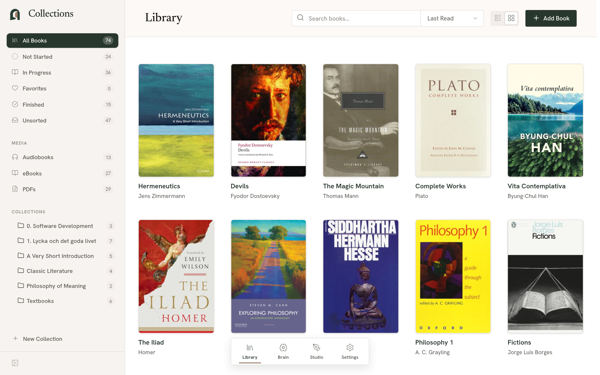
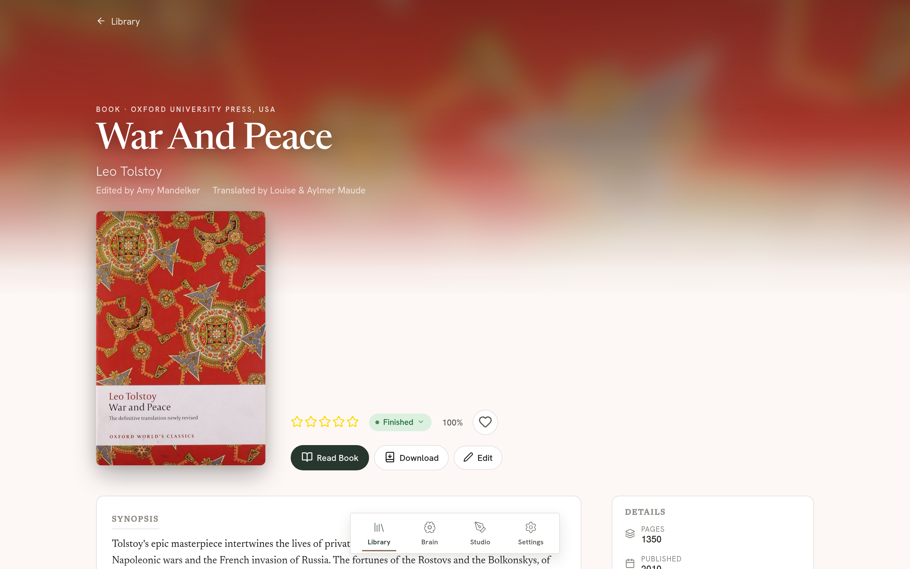
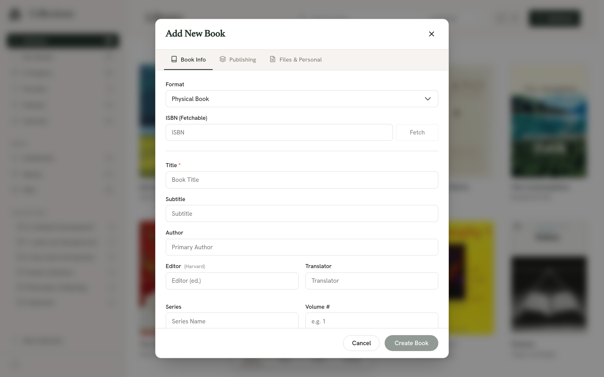
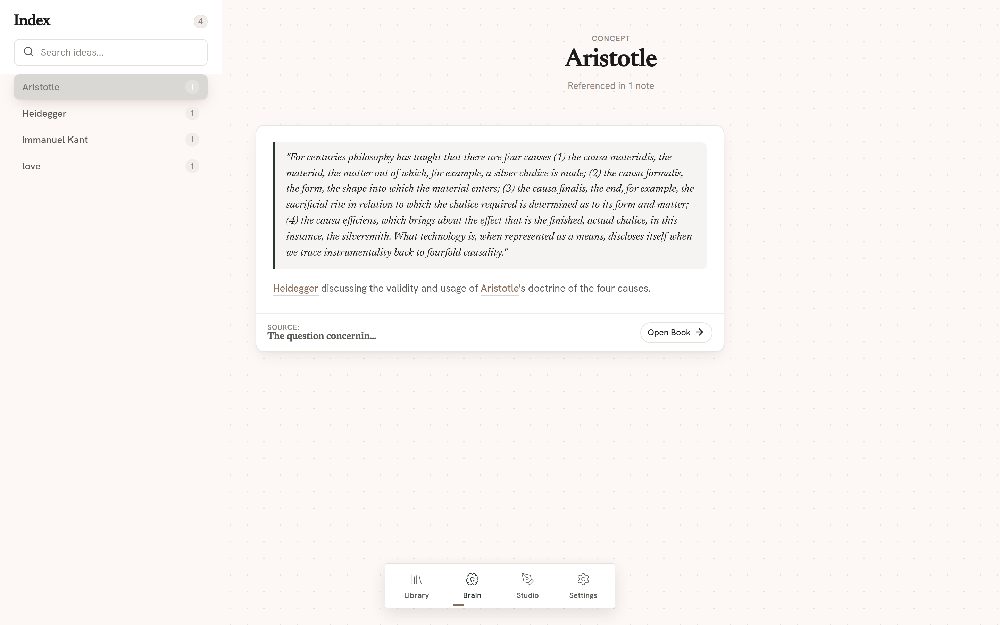
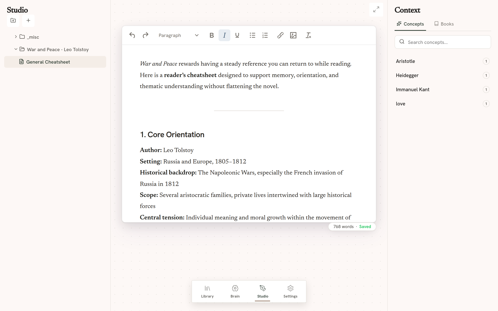

# Nostos

A self-hosted personal library and knowledge management system. Manage books, e-books, audiobooks, and PDFs in one place — then link what you read to the ideas you develop through contextual notes, concept mapping, and a built-in writing environment.

<div align="center">
  
</div>

## Features

### Library

- **Physical books** — ISBN lookup, reading status, full metadata
- **E-books (EPUB)** — Streaming reader with range request support
- **PDFs** — Integrated viewer
- **Audiobooks** — Chapter-aware player with M4B/M4A/MP3 metadata extraction
- **Collections** — Nested folder hierarchy, drag-and-drop organisation
- **Canonical library service** — Create-or-match dedupe on normalized ISBN/ASIN and exact title+author; validated progress; collections with sibling dedupe and cycle detection
- **Library MCP tools** — 11 authenticated agent tools for books and collections (create-or-match, update, resolve, collections)
- **Search, sort & filter** — By title, rating, recency, reading status, or collection

<details>
  <summary><strong>Screenshots</strong></summary>

  <br />

  <table>
    <tr>
      <td width="50%">
        <strong>Book Details</strong><br /><br />
        
      </td>
      <td width="50%">
        <strong>Add Book Modal</strong><br /><br />
        
      </td>
    </tr>
  </table>
</details>

### Reading Training

- **Standalone manual workflow** — Open `/training` to initialize the programme, assign library books, plan, start, pause, resume, finish, rate, and review sessions without Hermes.
- **Sustainable capacity** — Independent Endurance, Deep, and Recovery lanes begin at 40/30/20 minutes and adapt through deterministic weekly evidence rather than streaks or debt.
- **Multiple books and verbatim captures** — Train with different books in the same week; thoughts, questions, and bookmarks retain their exact text and book/session link.
- **Restart-safe and exact-once** — SQLite constraints, persisted elapsed time, command receipts, and idempotency keys prevent duplicate effects and preserve active or paused sessions across restarts.
- **Nostos-owned automation** — Weekly review and notification-outbox workers run inside Nostos. Reading data is included in normal `.nostos` backup/restore archives.
- **Optional integrations** — Authenticated local MCP exposes the same service as REST (34 tools across reading training and the library). The optional Hermes connector only routes the configured Telegram Reading topic and Discord #reading channel, and owns no state.

### Second Brain

- **Contextual notes** — Highlight text in EPUBs or PDFs and attach notes to the exact location
- **Wiki-link concepts** — Type `[[Concept]]` in any note to create or link a concept automatically
- **Concept explorer** — Browse all concepts sorted by usage; view every linked note in one place
- **Orphan cleanup** — Background worker removes concepts with zero references



### Writing Studio

- **Three-panel layout** — File tree, TinyMCE editor (markdown round-trip), and a context sidebar
- **Reference insertion** — Browse concepts or books in the sidebar, click a note to insert the quote
- **Auto-save** — 2-second debounced save on every keystroke

### Maintenance & Safety

- **Backup & Restore** — Automated weekly backups with manual triggers and real-time progress tracking
- **Integrity Verification** — Archive checksum validation and safety database snapshots before restoration
- **Maintenance Mode** — Automatic API protection during critical system updates
- **Storage Scanning** — Scan for existing `.nostos` backup files on disk to import history



## Tech Stack

| Layer          | Technology                                  |
| -------------- | ------------------------------------------- |
| Backend        | .NET 10 / ASP.NET Core Minimal APIs         |
| Database       | SQLite via Entity Framework Core 10         |
| Frontend       | Angular 21 (standalone components, Signals) |
| Readers        | epub.js, ngx-extended-pdf-viewer, Howler.js |
| Editor         | TinyMCE + marked + Turndown                 |
| Icons          | Lucide Angular                              |
| Audio metadata | z440.atl.core                               |

## Project Structure

```
Nostos-Rebirth/
├── Nostos.Backend/           # ASP.NET Core API
│   ├── Data/                 #   DbContext, models, repositories
│   ├── Endpoints/            #   Minimal API endpoint groups
│   ├── Services/             #   File storage, metadata, note processing
│   ├── Workers/              #   Background hosted services
│   └── Migrations/           #   EF Core migrations
├── Nostos.Frontend/          # Angular SPA
│   └── src/app/
│       ├── pages/            #   Library, BookDetail, SecondBrain, WritingStudio, Home
│       ├── reader/           #   EPUB, PDF, Audio readers + annotation managers
│       ├── core/             #   Services, directives, route strategy
│       ├── ui/               #   Shared components (FlatTree, NoteCard, StarRating, etc.)
│       └── layout/           #   WorkspaceLayout, AppDock
├── Nostos.Shared/            # Shared DTOs and enums (C#)
├── _docs/                    # Project documentation
└── _brand-assets/            # Logos and design resources
```

## Getting Started

### Prerequisites

- [.NET 10 SDK](https://dotnet.microsoft.com/download)
- [Node.js](https://nodejs.org/) (LTS)

### Quick Start

All commands run from the project root. Use `npm run help` to see the full list.

```bash
npm install          # install root tooling (concurrently)
npm start            # dev server — backend + frontend together
```

### Production

```bash
npm run prod         # builds the Angular frontend, then serves everything via .NET in Release mode
```

This runs `npm install` + `npm run build` for the frontend, copies the output to `wwwroot`, applies database migrations, and serves everything at **http://localhost:5099**.

### Individual Services

```bash
npm run backend      # .NET backend only — Debug (http://localhost:5099)
npm run frontend     # Angular dev server only (http://localhost:4200)
npm run build:frontend  # Angular production build
```

The frontend proxies `/api` requests to the backend via `proxy.conf.json`.

### Configuration

| Setting      | Detail                                                       |
| ------------ | ------------------------------------------------------------ |
| Database     | SQLite (`nostos.db`), auto-migrated on startup               |
| File storage | `Storage/books/` (configurable via `FileStorageSettings`)    |
| CORS (dev)   | Handled by `proxy.conf.json` — no backend CORS config needed |
| Reading UI   | `/training`; fully functional with MCP and Hermes disabled   |
| MCP (reading + library) | Opt-in `Mcp:Enabled` (route `/mcp`); bearer token is read from an environment variable only (default `NOSTOS_MCP_TOKEN`) |

## Documentation

Detailed documentation is available in the `_docs/` directories:

| Directory                | Contents                                                                   |
| ------------------------ | -------------------------------------------------------------------------- |
| `_docs/`                 | Architecture, API reference, getting started, concept system               |
| `Nostos.Backend/_docs/`  | Data models, repositories, services, endpoints, database                   |
| `Nostos.Frontend/_docs/` | Components, services, routing, state management, reader system, UI library |

Reading Training's domain contract is in [`docs/reading-training/`](docs/reading-training/README.md), with the concise frozen-v1 summary in [`docs/reading-training-v1.md`](docs/reading-training-v1.md). REST and gateway routes are documented in [`Nostos.Backend/_docs/endpoints.md`](Nostos.Backend/_docs/endpoints.md); optional Hermes deployment and rollback are documented in [`integrations/hermes/README.md`](integrations/hermes/README.md).

## Roadmap

- Mobile interaction improvements
- Cross-media bookmarking
- Audiobook metadata enrichment
- Recursive collection picker

## License

This project is licensed under the **GNU General Public License v3.0 or later**.

Copyright (C) 2026 Christian Gennari

See the [LICENSE](./LICENSE) file for the full license text.
