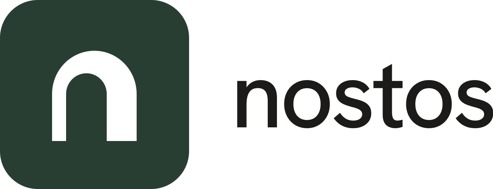
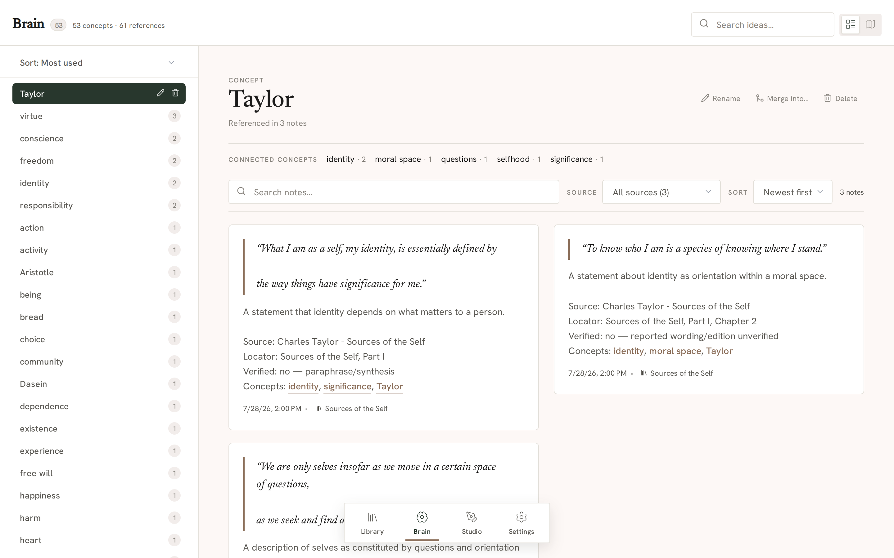
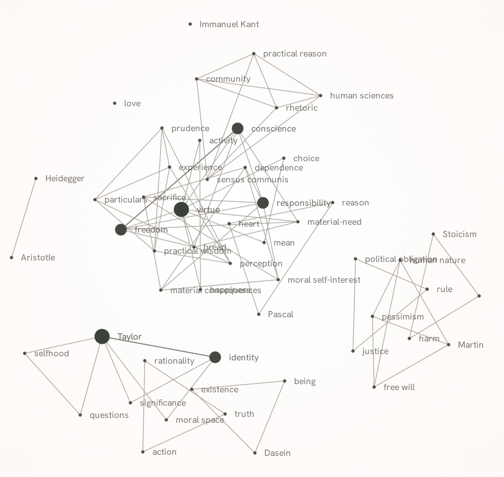

<div align="center">
  <picture>
    <source media="(prefers-color-scheme: dark)" srcset="docs/brand/logo-dark.svg" />
    <source media="(prefers-color-scheme: light)" srcset="docs/brand/logo-light.svg" />
    
  </picture>

  <p><strong>A quiet digital study for serious readers, scholars, and thinkers.</strong></p>
  <p>Self-hosted, local-first library and personal knowledge system — built to bridge what you read with what you write.</p>

  <p>
    <a href="#features">Features</a> •
    <a href="#getting-started">Getting Started</a> •
    <a href="#architecture--tech-stack">Tech Stack</a> •
    <a href="#documentation">Docs</a> •
    <a href="#license--trademark">License</a>
  </p>
</div>

<hr>

<div align="center">
  
</div>

## The Vision: The Quiet Study

Most modern software demands your attention with notification badges, reading streaks, algorithmic feeds, and aggressive upsells. **Nostos** takes the opposite approach:

* **Nordic Editorial Aesthetic:** Warm paper tones, literary typography (Newsreader & Hanken Grotesk), and distraction-free layouts inspired by physical publishing and classical libraries.
* **Local-First & Sovereign:** Your library, annotations, and personal thoughts stay completely on your machine. Fully operational offline without third-party subscriptions or cloud lock-in.
* **No Rent-Seeking on Thought:** No algorithmic feeds, reading streaks, aggressive upsells, or distracting popups. Just your books and your ideas.
* **A Unified Intellectual Loop:** Read physical volumes, e-books, PDFs, or audiobooks; capture contextual notes with wiki-links; develop those thoughts into prose in the integrated Writing Studio.

---

## Features

### The Library
Collect, organize, and consume your entire media collection in one unified repository:
* **All Your Formats:** Physical books (ISBN metadata lookup), EPUBs (streaming reader with continuous range requests), PDFs (integrated clean viewer), and audiobooks (chapter-aware M4B/M4A/MP3 player).
* **Thoughtful Organization:** Flexible nested collections, drag-and-drop management, custom tags, and multi-parameter filtering (by status, rating, recency, or collection).
* **Smart Deduplication & Works:** Canonical cataloging with multi-edition work grouping, automatically matching on normalized ISBNs or title + author pairs.

<details>
  <summary><strong>View Library Screenshots</strong></summary>
  <br />
  <table>
    <tr>
      <td width="50%">
        <strong>Book Overview & Progress</strong><br /><br />
        
      </td>
      <td width="50%">
        <strong>Clean Cataloging & Import</strong><br /><br />
        
      </td>
    </tr>
  </table>
</details>

---

### Brain & Concept Graph
Transform passive reading into active, connected understanding:
* **In-Context Annotations:** Highlight passages directly inside EPUBs and PDFs and link thoughts to exact paragraphs.
* **Bi-Directional Wiki-Links:** Type `[[Concept]]` anywhere in your notes to automatically link or discover emerging ideas.
* **Concept Explorer & Graph Map:** Browse all interconnected concepts, visualize the dynamic network of linked ideas in the interactive concept map, and keep your graph clean with automated zero-reference cleanup.

<div align="center">
  
</div>

<div align="center">
  
</div>

---

### Writing Studio
Bring your synthesis together without switching tools:
* **Focused Three-Panel Workspace:** Manage your chapter tree, draft in a distraction-free markdown/rich editor (TinyMCE + Turndown), and inspect reference material simultaneously.
* **Direct Citation & Note Insertion:** Keep your research library visible in the side panel. Click any note or highlight to insert exact quotations into your draft.
* **Continuous Auto-Save:** Background, debounced saving keeps your drafts safe without breaking flow.

<div align="center">
  
</div>

---

### Resilience & Safety
* **Zero-Hassle Backups:** Create complete `.nostos` archives encompassing database, notes, and local files.
* **Integrity First:** Checksum verification and pre-restore database snapshots ensure your data is never corrupted during updates.
* **Autonomous Maintenance:** Automatic maintenance mode guarantees clean database migrations.

---

## Architecture & Tech Stack

Nostos is engineered as an efficient, low-overhead system capable of running comfortably on anything from a home server to a lightweight laptop:

* **Backend:** [.NET 10](https://dotnet.microsoft.com/) Minimal APIs (ultra-fast, memory-efficient)
* **Database:** SQLite via Entity Framework Core 10 (single-file, robust, zero configuration)
* **Frontend:** [Angular 21](https://angular.dev/) (Standalone Components, Signals, high-performance UI)
* **Readers:** `epub.js` (streaming e-reader), `ngx-extended-pdf-viewer`, `Howler.js` (audiobook engine)
* **Editor:** TinyMCE with bidirectional markdown round-tripping
* **Icons & Typography:** Lucide, Newsreader Serif, and Hanken Grotesk

`Nostos-Rebirth` is the canonical, fully self-hostable product repository. Its
public executable runs SelfHosted with SQLite, local media and local backup/restore.
The official hosted Nostos Cloud service is composed in the private
[`Nostos-Cloud`](https://github.com/Christian-Gennari/Nostos-Cloud) repository,
which consumes this repository's `Nostos.Product` and the same Angular frontend at
one pinned public commit. Reusable product, domain and frontend changes land here
first; hosted operations and provider implementations stay private.

```text
Nostos-Rebirth/
├── Nostos.Product/       # canonical product/domain/application/API composition
├── Nostos.Backend/       # public SelfHosted host: SQLite, files, local backup, BYOK
├── Nostos.Shared/        # shared DTOs and business contracts
├── Nostos.Frontend/      # one Angular SPA for SelfHosted and official Cloud
└── docs/                 # product and boundary architecture
```

---

## Getting Started

### Prerequisites
* [.NET 10 SDK](https://dotnet.microsoft.com/download)
* [Node.js (LTS)](https://nodejs.org/)
* *(Optional)* `ffmpeg` and `ffprobe` — required only to import LibriVox
  audiobooks, which are assembled into a single chaptered `.m4b`. Everything
  else, including Project Gutenberg imports, works without them. See
  [Content Providers & Acquisition](docs/content-providers.md).

### Quick Start (Development)
Clone the repository and start both backend and frontend concurrently:

```bash
git clone https://github.com/Christian-Gennari/Nostos-Rebirth.git
cd Nostos-Rebirth

# Install dependencies and start the unified dev environment
npm install
npm start
```
The app will be live at `http://localhost:4200` (proxying API calls to backend port `5099`).

### Production Build
To build the frontend and serve everything through the single high-performance .NET host:

```bash
npm run prod
```
Open **`http://localhost:5099`** in your browser.

---

## Brand & Aesthetic Dignity

The Nostos mark represents a doorway into a quiet study: a **Forest Green (`#293E32`)** rounded tile with a **White (`#FFFFFF`)** arch knocked out of it, forming a subtle lowercase `n`. 

The mark is deliberately theme-invariant across both light and dark study environments. Read our full philosophical foundation in the [Design Manifesto](docs/design-manifesto.md) and explore the brand kit in [`_brand-assets/`](_brand-assets/README.md).

---

## Documentation & Roadmap

* **[Design Manifesto](docs/design-manifesto.md):** The core principles and aesthetic guidelines of Nostos.
* **[MCP Library Contracts](docs/library-mcp-contracts.md):** Specification for Model Context Protocol agents and tools.
* **[Content Providers & Acquisition](docs/content-providers.md):** How external catalogues (Gutenberg, LibriVox) are imported as ordinary local books.
* **[Backend Endpoints](Nostos.Backend/_docs/endpoints.md):** REST API reference.
* **[Public/private boundary ADR](docs/adr/cloud-public-private-boundary.md):** one public Nostos product and the private official hosted composition.
* **[Deployment capabilities](docs/cloud/deployment-modes.md):** product-level SelfHosted and hosted capability contract.
* **[Portable archives](docs/cloud/portability.md):** provider-neutral `.nostos` export/import contract.
* **[PostgreSQL product-model compatibility](docs/cloud/postgresql-compatibility-spike.md):** evidence for the shared relational model.

### Active Roadmap
* [ ] Enhanced mobile navigation and touch interaction
* [ ] Cross-media unified bookmarks
* [ ] Automated bibliographic enrichment (ISBN / DOI / BibTeX)
* [ ] Recursive collection hierarchy manager

---

## License & Trademark

* **Software License:** Licensed under the **[GNU General Public License v3.0 (GPLv3)](./LICENSE)**. You are free to run, study, modify, and distribute the code under these terms.
* **Trademark Policy:** "Nostos", "Nostos Study", and the distinctive arch logo are proprietary marks. Forks and community builds are welcomed under the GPLv3, but must be distributed under an independent name and distinct visual branding. See [TRADEMARK.md](./TRADEMARK.md) for details.
